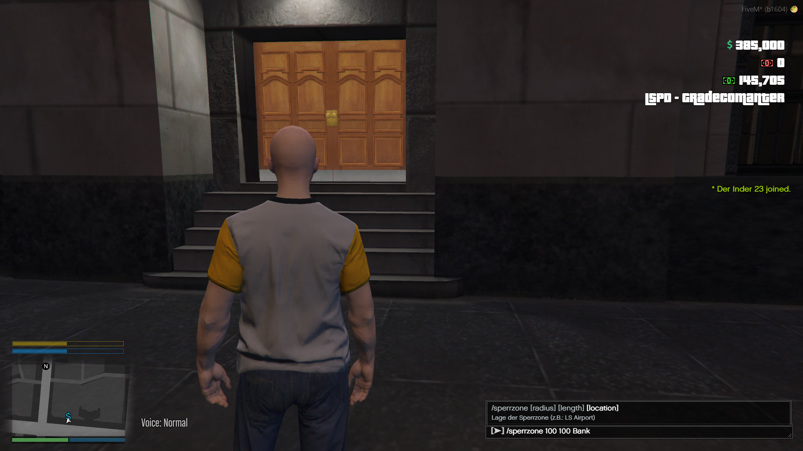
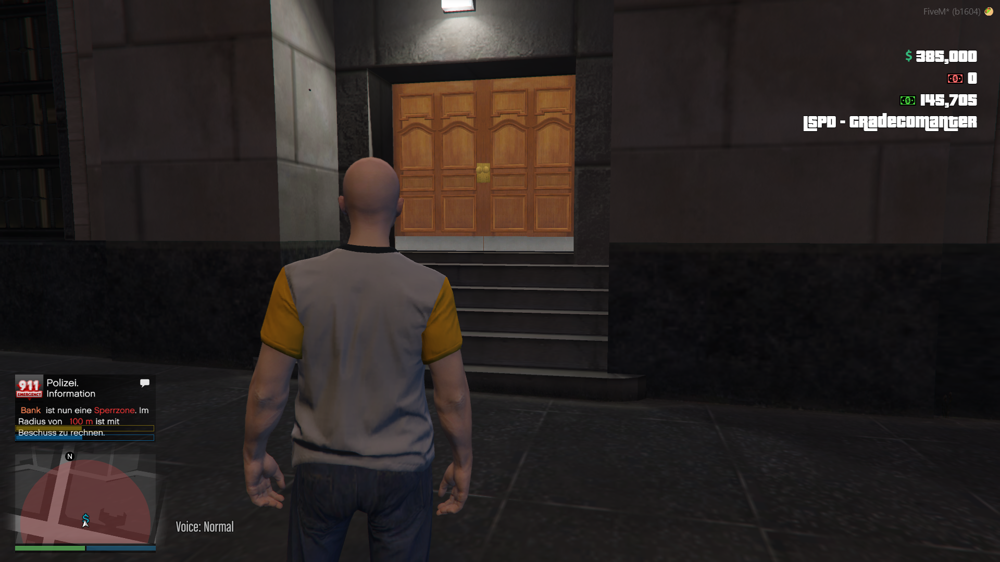
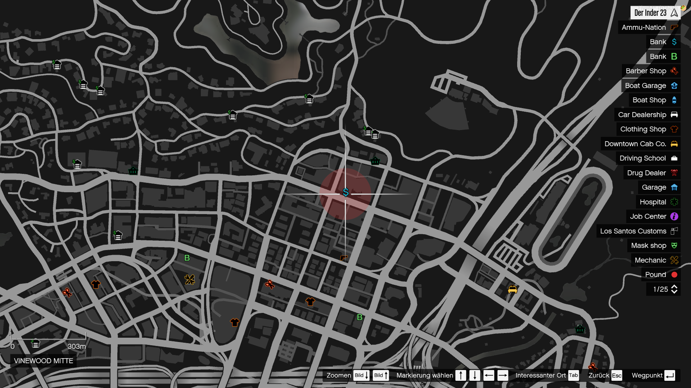
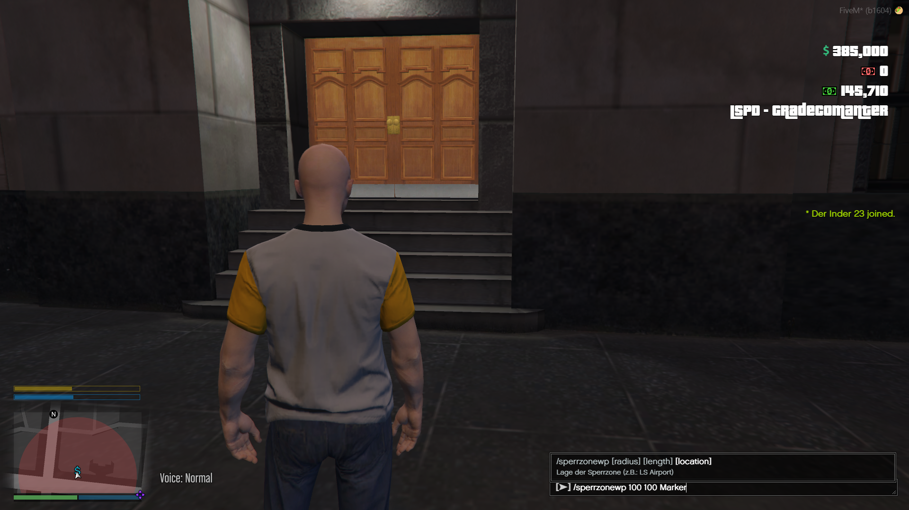
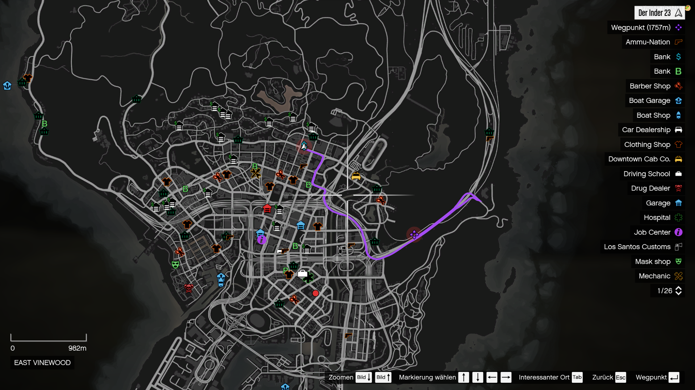
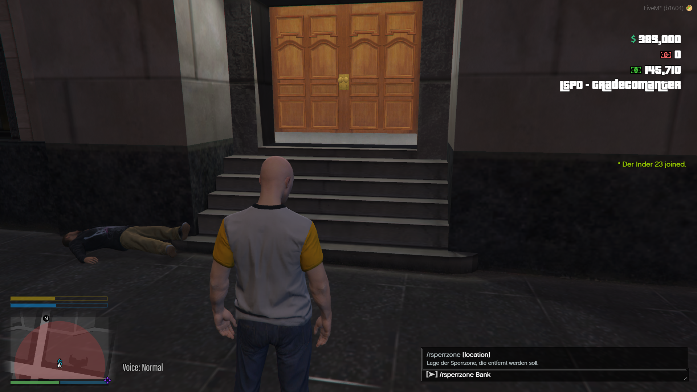
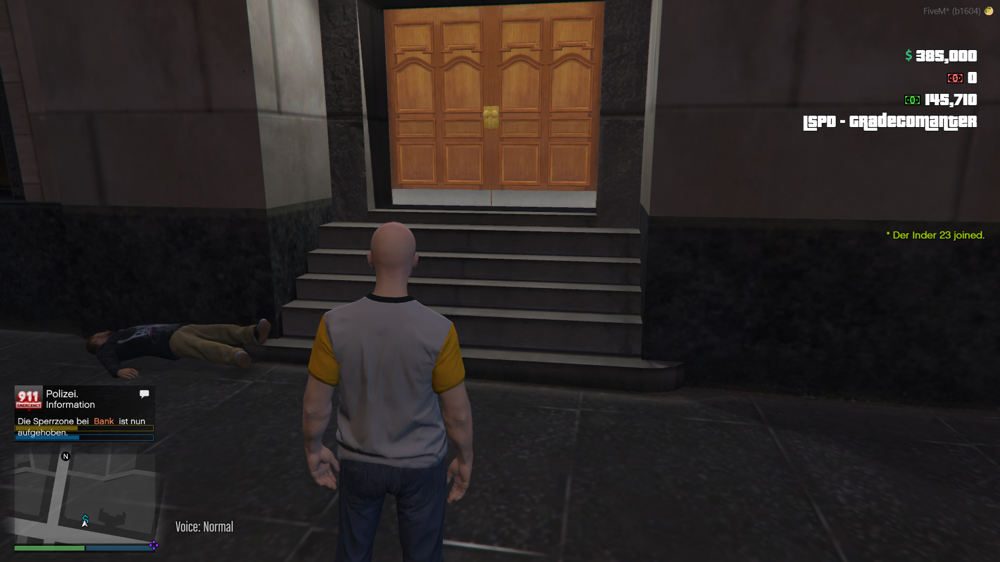
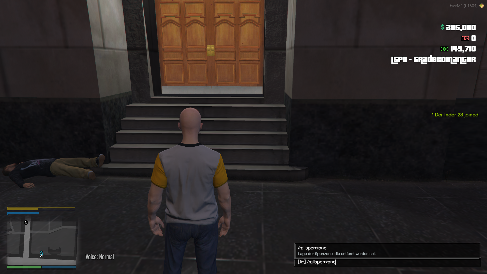

<a name="readme-top"></a>

<!-- PROJECT LOGO -->
<br />
<div align="center">
  <a href="https://discord.gg/G9zzDPvF4Y">
    
  </a>

  <h3 align="center">LifePeak - Skripts</h3>

  <p align="center">
    Any fool can write code that a computer can understand. Good programmers write code that humans can understand!
    <br />
    <a href="https://lifepeak-scripts.tebex.io"><strong>Explore us on Tebex  »»</strong></a>
    <br />
    <br />
    <a href="https://www.youtube.com/channel/UC8tftArZtDQz_0bohnnidoA">View Demos</a>
    ·
    <a href="https://discord.gg/G9zzDPvF4Y">Report Bug</a>
    ·
    <a href="https://discord.gg/G9zzDPvF4Y">Request Feature</a>
  </p>
</div>


<!-- TABLE OF CONTENTS 
<details>
  <summary>Table of Contents</summary>
  <ol>
    <li>
      <a href="#about-the-project">About The Project</a>
      <ul>
        <li><a href="#built-with">Built With</a></li>
      </ul>
    </li>
    <li>
      <a href="#getting-started">Getting Started</a>
      <ul>
        <li><a href="#prerequisites">Prerequisites</a></li>
        <li><a href="#installation">Installation</a></li>
      </ul>
    </li>
    <li><a href="#usage">Usage</a></li>
    <li><a href="#roadmap">Roadmap</a></li>
    <li><a href="#contributing">Contributing</a></li>
    <li><a href="#license">License</a></li>
    <li><a href="#contact">Contact</a></li>
    <li><a href="#acknowledgments">Acknowledgments</a></li>
  </ol>
</details>
-->


<!-- ABOUT THE PROJECT -->
## Explore Lifepeak
### What's Lifepeak-Scripts?
Lifepeak is a small developing team of three members. We are specialized in Five-M Scripting, Hosting, Managing Servers.


### What we offer ?

This section list our Supported Programming Languages and Frameworks.

### Programming Languages:


### Frameworks:


--------------
<p align="right">(<a href="#readme-top">back to top</a>)</p>

### Which Platforms we're supporting?
We're currently supporting this platforms if you have any Questions regarding Linux or Windows feel free to contact us.


## Interested? Find us on:

 * [](https://discord.gg/G9zzDPvF4Y)
 * [](https://discord.gg/G9zzDPvF4Y)
 * [](https://gitlab.lifepeak.de/lifepeak-freescripts)
 * [](https://lifepeak.de/)

<!-- GETTING STARTED -->


# lp_sperrzone

lp_sperrzone is an simple all in one Skript to manage resticet zones, like crime scene.
You can configurate the used notifaction System and many more.

### Preview
<a href="./preview/sperrzone.png">

</a>
<a href="./preview/sperrzone_msg.png">

</a>

<a href="./preview/sperrzone_map.png">

</a>

<a href="./preview/sperrzone_marker.png">

</a>
<a href="./preview/sperrzone_marker_2.png">

</a>
<a href="./preview/sperrzone_remove.png">

</a>
<a href="./preview/sperrzone_remove_msg.png">

</a>
<a href="./preview/sperrzone_removeall.png">

</a>
#### If a cop is inside a marker, it always gets renewed if time to expire.
### Installation

1. Download the Script at [Lifepeak-Gitlab](https://gitlab.lifepeak.de/lifepeak-freescripts/lp_sperrzone) and drag the lp_sperrzone folder into your resources folder.
2. Before you start you should read the config.lua and make changes if necessary.
   ```lua
    Config = {}
    Config.Locale  = 'de'
    Config.PoliceJobs      = {"police", "swat", "fib", "sheriff"}
    Config.Command         = "sperrzone"
    Config.CommandWayPoint = "sperrzonewp"
    Config.CommandRemove   = "rsperrzone"
    Config.CommandRemoveAll= "rallsperrzone"
    Config.NotificationPicture = 'CHAR_CALL911' --https://wiki.gtanet.work/index.php?title=Notification_Pictures
    
    Config.MaxRadius   = 2000     -- Maximal radios in meter
    Config.MaxTime     = 60 * 10  -- Maximal allowed time a Sperrzone will remain (if not deleted beforehand)
    Config.RenewalTime = 60 * 3   -- Time in seconds the Sperrzone will be renewed if cops are in the area.
    Config.Notification = {}
    Config.Notification.System = 'none' -- none / lp_notify
    Config.Notification.displaytime = 1300 --ms
    Config.Notification.Postion = "top right" -- Only works lp_notify! | lp_"top right", [top Left, top Right, bottom Left, bottom Right]
   ```
3. add the staring command to your server.cfg
   ```cfg
   start lp_sperrzone
   ```
It is recommended to use a lp_notify as Notification-System.
-> [lp_notify](https://scripts.lifepeak.de/package/5124963)
### If you have any questions, contact the LifePeak team.
<p align="right">(<a href="#readme-top">back to top</a>)</p>


<!-- USAGE EXAMPLES -->
## Usage to create / delete mobile speed camera
1. Type ```/sperrzone {radius} {length} {location} ``` to create a resticet Zone at your position.
2. Type ```/sperrzonewp {radius} {length} {location} ``` to create a resticet Zone by using your Map Waypoint.
3. Type ```/rsperrzone {location} ``` to remove an existing resticet Zone.
4. Type ```/rallsperrzone ``` to remove an all existing resticet Zones.

<p align="right">(<a href="#readme-top">back to top</a>)</p>


<!-- CONTRIBUTING 
## Contributing

Contributions are what make the open source community such an amazing place to learn, inspire, and create. Any contributions you make are **greatly appreciated**.

If you have a suggestion that would make this better, please fork the repo and create a pull request. You can also simply open an issue with the tag "enhancement".
Don't forget to give the project a star! Thanks again!

1. Fork the Project
2. Create your Feature Branch (`git checkout -b feature/AmazingFeature`)
3. Commit your Changes (`git commit -m 'Add some AmazingFeature'`)
4. Push to the Branch (`git push origin feature/AmazingFeature`)
5. Open a Pull Request

<p align="right">(<a href="#readme-top">back to top</a>)</p>
-->